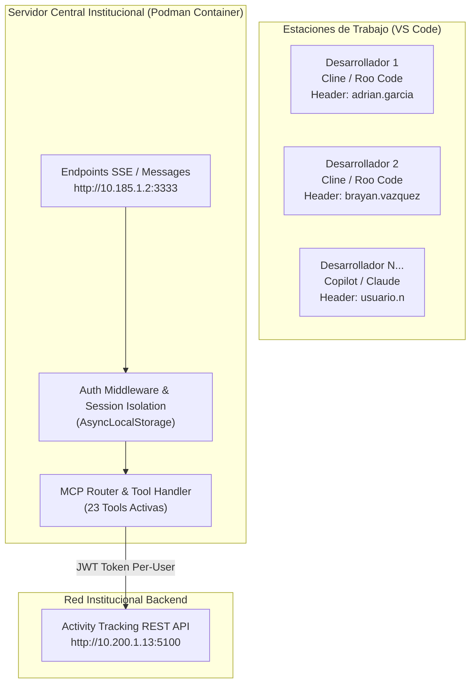

# Servidor MCP: Activity Tracking API (Node.js, TypeScript & Podman)

Servidor oficial compatible con el **Model Context Protocol (MCP)** para integrar asistentes de inteligencia artificial en VS Code (Cline, Roo Code, GitHub Copilot) con el sistema institucional **Activity Tracking API** (`http://10.200.1.13:5100`).

Soporta despliegue **Centralizado en Contenedor Podman (Transporte HTTP/SSE Multi-Usuario)** y ejecución local por **Stdio**.

---

## 🏗️ Arquitectura de Despliegue Centralizado (Podman)



---

## 🌟 Características Principales

1. **Transporte Dual (SSE + Stdio):**
   - **HTTP/SSE (`/sse` y `/messages`):** Servicio centralizado multi-usuario en puerto `3333`.
   - **Stdio:** Modo de compatibilidad para CLI y desarrollo offline.
2. **Aislamiento Multi-Usuario en Memoria (`AsyncLocalStorage`):**
   - El servidor no almacena contraseñas en archivos `.env` ni variables de entorno del contenedor.
   - Cada cliente envía sus credenciales dinámicas en encabezados `X-Auth-Username` y `X-Auth-Password`.
   - Los tokens JWT se generan y aíslan por sesión de usuario, eliminando colisiones en llamadas concurrentes.
3. **Cero Polución en Producción:**
   - **Prioridad de Solo Lectura:** Endpoints `GET` para Work Items de Sprints, Actividades, Reuniones y Métricas.
   - **Modo Dry-Run:** Todas las mutaciones (`POST`, `PUT`, `PATCH`) se interceptan y validan sin afectar la base de datos productiva cuando `DRY_RUN_MODE=true`.
4. **Motor de Inferencia Semántica NLP:** Traduce solicitudes en lenguaje natural a identificadores institucionales exactos (`projectId`, `serviceId`, `productId`, `responsibleId`).

---

## 🐳 Comandos de Podman (Construcción y Despliegue)

### 1. Construir la imagen:
```bash
podman build -t mcp-activity-tracking:latest .
```

### 2. Ejecutar el contenedor:
```bash
podman run -d \
  --name mcp-activity-tracking-server \
  -p 3333:3333 \
  --restart=always \
  -e DRY_RUN_MODE=true \
  mcp-activity-tracking:latest
```

### 3. Verificar salud del servicio:
```bash
curl http://localhost:3333/health
```

Respuesta esperada:
```json
{
  "status": "ok",
  "server": "activity-tracking-mcp-server",
  "transport": "sse",
  "activeSessions": 0,
  "uptimeSeconds": 45,
  "dryRunMode": true,
  "apiBaseUrl": "http://10.200.1.13:5100"
}
```

---

## 🛠️ Desarrollo Local y Pruebas Automatizadas

```bash
# Compilar TypeScript a JavaScript (dist/)
npm run build

# Prueba de simulación Dry-Run (23 herramientas)
npm run test:dryrun

# Prueba de integración Stdio JSON-RPC
npm run test:stdio

# Prueba de concurrencia multi-usuario SSE
npm run test:sse
```

---

## 📋 Guías de Configuración por Cliente

* **VS Code (Cline, Roo Code y GitHub Copilot):** Consulta [VSCODE_SETUP.md](./VSCODE_SETUP.md).
* **Claude Desktop:** Consulta [docs/CLAUDE_DESKTOP_SETUP.md](./docs/CLAUDE_DESKTOP_SETUP.md).

## Publicacion automatica del paquete MCPB

El workflow `.github/workflows/publish-mcpb.yml` se ejecuta en cada push a `master`.
Compila el servidor, genera el manifiesto con las herramientas actuales y publica
un paquete `activity-tracking.mcpb` en el Release `mcpb-latest`.

El paquete se puede descargar desde:

```text
https://github.com/ORGANIZACION/REPOSITORIO/releases/download/mcpb-latest/activity-tracking.mcpb
```

Descarga ese archivo y arrastralo a Claude Desktop en Settings > Extensions.
El workflow requiere que GitHub Actions tenga permiso `Read and write permissions`
para contenidos del repositorio. Tambien se puede ejecutar manualmente desde
Actions > Build and publish MCPB.

Para generar el paquete localmente:

```bash
npm ci
npm run package:mcpb
```
