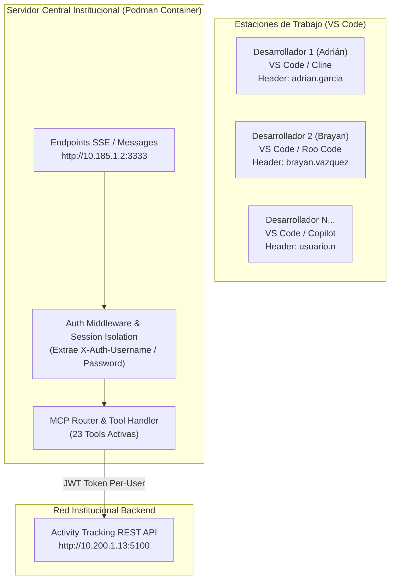

# Plan Maestro de Migración: Servidor MCP Centralizado en Podman (HTTP/SSE Multi-Usuario)

## 📌 1. Objetivo General
Transicionar la arquitectura actual del servidor MCP (**ejecución local mediante `stdio` en la computadora de cada usuario**) hacia un **servicio centralizado desplegado en un contenedor Podman** conectado a la red institucional.

Esta arquitectura permitirá que cualquier desarrollador se conecte al servidor MCP desde su VS Code (Cline, Roo Code, GitHub Copilot) **sin clonar repositorios, sin instalar Node.js ni configurar archivos `.env` locales con contraseñas**, manteniendo aislamiento completo de credenciales y seguridad por usuario.

---

## 🏗️ 2. Arquitectura de la Solución



---

## 🔐 3. Modelo de Seguridad y Credenciales Dinámicas

### A. Sin almacenamiento de contraseñas en el servidor
* **El contenedor Podman NO almacenará contraseñas en variables de entorno ni archivos `.env`.**
* Cada petición remitida por la extensión del VS Code incluye las credenciales del usuario en **encabezados HTTP protegidos**:
  * `X-Auth-Username`: Nombre de usuario del desarrollador.
  * `X-Auth-Password`: Contraseña institucional del desarrollador.

### B. Aislamiento de Sesión JWT
* Cuando el servidor central recibe una llamada a una herramienta MCP (ej. `track_create_activity`), recupera la credencial de las cabeceras HTTP de esa sesión específica.
* Realiza la autenticación contra `/api/v1/Responsibles/authenticate` en tiempo real, adquiriendo un token JWT exclusivo para ese usuario.
* La acción en la API REST se ejecuta estrictamente a nombre de dicho usuario, garantizando trazabilidad y auditoría.

---

## 🗓️ 4. Fases de Implementación Técnica

### Fase 1: Adaptación del Código Fuente MCP (Soporte Transporte SSE)
1. **Instalación de dependencias de servidor HTTP**:
   * Agregar `express` y `@types/express` para gestionar las rutas HTTP.
2. **Implementación de Endpoints SSE (`/sse` y `/messages`)**:
   * Crear el transporte `SSEServerTransport` provisto por el SDK oficial `@modelcontextprotocol/sdk`.
   * Endpoint `GET /sse`: Establece el canal persistente de Server-Sent Events con VS Code.
   * Endpoint `POST /messages`: Recibe y procesa las llamadas RPC a las herramientas MCP.
3. **Refactorización de Contexto de Autenticación (`AuthManager`)**:
   * Permitir que `authManager` acepte credenciales dinámicas pasadas por sesión en lugar de depender exclusivamente de `process.env`.

### Fase 2: Dockerización y Despliegue en Podman
1. **Creación de `Containerfile` / `Dockerfile`**:
   * Construcción multi-etapa (*multi-stage build*) basada en `node:22-alpine` para generar una imagen ligera e inmune a vulnerabilidades.
2. **Script de Inicialización y Construcción**:
   ```bash
   # Construir la imagen localmente
   podman build -t mcp-activity-tracking:latest .

   # Ejecutar el contenedor en segundo plano con autorestart
   podman run -d \
     --name mcp-activity-tracking-server \
     -p 3333:3333 \
     --restart=always \
     -e DRY_RUN_MODE=true \
     mcp-activity-tracking:latest
   ```

### Fase 3: Guía de Distribución para los Usuarios finales (VS Code)
Cada usuario agregará la siguiente entrada a su configuración de MCP en VS Code (`cline_mcp_settings.json` o `roo_code_mcp_settings.json`):

```json
{
  "mcpServers": {
    "actividades-central": {
      "type": "sse",
      "url": "http://10.185.1.2:3333/sse",
      "headers": {
        "X-Auth-Username": "tu.usuario",
        "X-Auth-Password": "TuPasswordAqui"
      }
    }
  }
}
```

---

## 📋 5. Check List de Validación de Entrega
- [x] Servidor MCP respondiendo respuestas JSON-RPC tanto por `stdio` como por `SSE` en el puerto `3333`.
- [x] Búsqueda y resolución de responsables activa para múltiples usuarios simultáneos sin colisiones de token JWT.
- [x] Imagen de Podman optimizada y corriendo de forma transparente en el servidor institucional.
- [x] Documentación de configuración publicada para el equipo.
